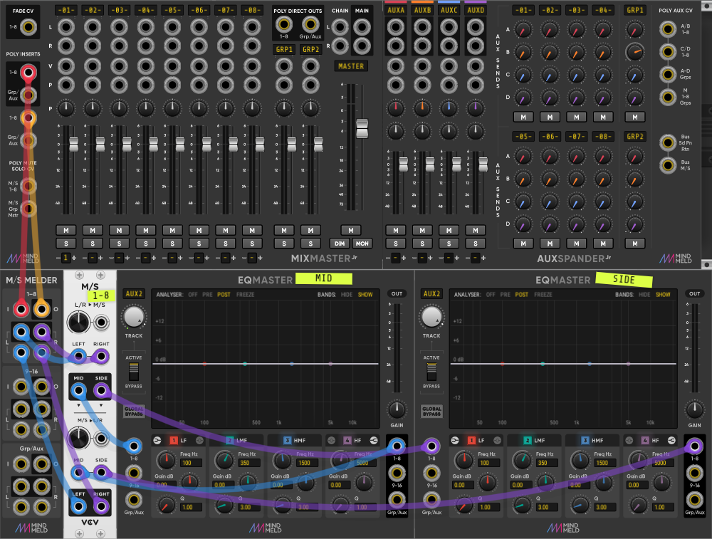
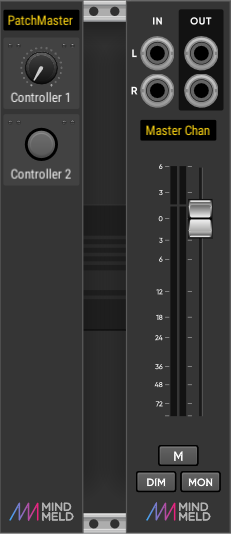
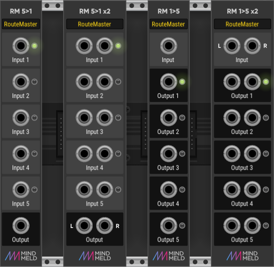

Modules for [VCV Rack](https://vcvrack.com), available in the [plugin library](https://vcvrack.com/plugins.html).

Mind Meld is a designer / developer collaboration for VCV Rack between Marc '_Spock_' Boulé (coding and development) and Steve '_Make it so_' Baker (concept and design). 

Version 2.1.1

[//]: # (!!!!!UPDATE VERSION NUMBER IN PLUGIN.JSON ALSO!!!!!   140% Zoom for pngs, all size of MixMaster.png, use transparency)

# Manuals

Here are the manuals for [MixMaster/AuxSpander](https://github.com/MarcBoule/MindMeldModular/blob/master/doc/MindMeld-MixMaster-Manual-V1_1_4.pdf) and 
[ShapeMaster](https://github.com/MarcBoule/MindMeldModular/blob/master/doc/MindMeld-ShapeMaster-Manual-V1_0.pdf)

# Modules

The following modules are part of the MindMeld module pack:

* [MixMaster](#mixmaster): 16-track stereo mixer with 4 group busses.

* [AuxSpander](#auxspander): 4-aux FX bus expander for MixMaster.

* [MixMasterJr](#mixmasterjr): 8-track stereo mixer with 2 group busses.

* [AuxSpanderJr](#auxspanderjr): 4-aux FX bus expander for MixMasterJr.

* [EqMaster](#eqmaster): 24-track multiband EQ for MixMaster and MixMasterJr (user manual available soon).

* [EqSpander](#eqspander): CV expander for EqMaster.

* [Meld / Unmeld](#meldunmeld): Utility modules for MixMaster and MixMasterJr.

* [M/S Melder](#melder): Utility routing module to facilitate mid/side EQ'ing with VCV Mid/Side and EqMaster.

* [BassMaster](#bassmaster): Dual band spatialiser for high spread and bass mono.

* [ShapeMaster](#shapemaster): Multi-stage envelope generator (MSEG) / complex LFO.

* [PatchMaster / MasterChan](#patchmaster): Configurable multi-controller with parameter mapping and Master channel strip (for use with PatchMaster or standalone).

* [RouteMaster](#routemaster): 5-channel signal switchers (for use with PatchMaster or standalone).

## MixMaster

The MixMaster beams the following features into your Rack for your demanding mixing needs:

* 16 mono/stereo tracks
* 4 aux busses (requires [AuxSpander](#auxspander)) and 4 group busses
* Editable track labels (scribble strips)
* Gain adjustment (trim) on every track (±20 dB)
* Hi Pass Filter (HPF) on every track and bus (18 dB/oct.)
* Low Pass Filter (LPF) on every track and bus (12 dB/oct.)
* Fade automation with lin/log/exp curves
* Track re-ordering and copy/paste settings
* User selectable pan law
* Stereo balance and true stereo panning
* Accurate RMS and Peak VUs with peak hold
* User selectable VU colour and display colour
* Long fader runs and fader linking
* Inserts on every track and bus
* Direct outs for every track and bus
* Chain input
* Flexible signal routing options
* Dim and fold to mono on the Master
* CV visualisation
* CV control over just about everything...

Many labels contain separate menus that are different from the module's main menu; these can be accessed by right-clicking the labels.

## AuxSpander

4-aux FX bus expander for MixMaster, must be placed immediately to the right of the MixMaster module.

## MixMasterJr

A smaller 8-track version of MixMaster, with 2 group busses. Functionality and options are identical to those found in MixMaster.

## AuxSpanderJr

4-aux FX bus expander for MixMasterJr, must be placed immediately to the right of the MixMasterJr module. Functionality and options are identical to those found in AuxSpander.

## EqMaster

24-track multiband EQ for MixMaster and MixMasterJr. Can be placed anywhere in the patch, uses polyphonic cables for connecting to the inserts on the MixMaster mixers. Track names and colors can be linked to any MixMaster in the patch (right-click menu in EqMaster). Allows separate EQ control of each of the 24 stereo tracks. A [CV expander](#eqspander) is also available for added control over the module's parameters.

## EqSpander

Expander module to add CV control over most parameters in the EqMaster. All jacks on the module are polyphonic CVs, and it can be placed on either side of the EqMaster. The state jacks at the top control the active/bypass status of the 24 tracks, with the global bypass located in channel 9 of the G/A jack; the other 24 jacks (one for each track) control the 4 parameters (state, freq, gain, Q) for each of the 4 bands in each track.

## Meld / Unmeld

Two utility modules to help manage direct out and insert connections. Three panel options are available in each module: 1-8, 9-16, Grp/Aux. The 8 LEDs in the right side of the Meld module can be clicked and are used to bypass an insert (red), or not (green). The Meld module also features a set of panels for merging the CV poly-inputs found on the MixMaster and AuxSpander modules.

## M/S Melder

A utility module (bottom left in the picture above) to simplify the patching of mid/side EQ'ing with VCV Mid/Side and EqMaster. The picture above shows how to connect M/S Melder on the mixer inserts for tracks 1-8; the same patching technique can be used for tracks 9-16 (applicable only to the 16-track MixMaster) and Groups/Auxes, each requiring only an additional VCV Mid/Side module.

## BassMaster

Dual band stereo width controllers for bass mono and high spread. Both modules have the same core functionality; however the Jr version omits the mix and master gain controls, the VU meter and the width CV inputs.

## ShapeMaster

Multi-stage envelope generator (MSEG) / complex LFO:

* 8 Polyphonic channels
* Built in VCA and CV out on every channel
* Draw complex shapes with up to 270 nodes
* Hundreds of built in Shapes and Presets
* Powerful random shape generation
* Freeze, Sustain and Loop envelopes
* Flexible Trigger modes
* Play forward, reverse or pingpong
* Repeat count from 1 to 99 or Infinite (LFO)
* All controls independently set per channel
* Integrated dual band crossover
* Unsynced lengths from 0.56ms to 30 minutes
* Built-in scope shows pre and post envelope
* Gain adjustment (Trim) on every track (± 20dB)
* Editable Channel Labels
* Trigger generation from sidechain audio

The ShapeMaster Pro (not shown) is a commercial plugin which adds the following features 

* Sync and quantise channels to clock
* Synced lengths from 1/128 to 128 bars
* Includes triplet and dotted lengths
* CV Visualisation
* SM-CV expander module for CV control
* SM-Triggers expander module
* uMeld module - 8 channel poly merge module
* ShapeTracker module - Shape section gate and trigger generator for ShapeMaster Pro

The ShapeMaster Pro plugin can be purchased in the [VCV Rack plugin library](https://library.vcvrack.com/MindMeld-ShapeMasterPro).

## PatchMaster / MasterChan

Configurable multi-controller with parameter mapping, and a Master channel strip for use with PatchMaster or standalone. Developed in collaboration with Omri Cohen ([video manual](https://www.youtube.com/watch?v=uyQhRD1sc0A)).

PatchMaster is a performance controller for Rack. PatchMaster enables you to build custom interfaces made up of knobs, buttons and faders, with editable labels, to control the key parts of your patch.  PatchMaster allows you to simplify your patch, avoid all the clutter/distractions and focus only on what's important for performance.

Three main use cases for PatchMaster:

1. Use it as a performance controller for multi-track patches;
2. Use it to create an interface for synth emulations;
3. Use it to create macro controllers.

### How does PatchMaster work?

When you first instantiate PatchMaster it looks like a rather underwhelming 4hp strip with one knob and one button - but don't let that fool you - under the hood PatchMaster is a very powerful and flexible module. You can add whatever knob, button or fader controllers to PatchMaster you want and midi map them to controls on the modules in your patch. Each controller can be mapped to up to 4 different destinations with different ranges - so each controller can act as a macro. You can add as many instances of PatchMaster as you need and when you place PatchMaster modules next to each other they join together to look like a single module - it is a modular interface for your modular synth!

Everything in PatchMaster is controlled through menus. There are two types of menu:

1. Main panel menu for editing global settings of the module and adding new controllers and separators;
2. Controller menu for editing and mapping controllers.

### What kind of controllers are there?

Knobs: Small, Medium or Large - Unipolar or Bipolar
Buttons: Momentary, Latched, Latched with inverted light, Radio Trig, Radio Latched
(Radio buttons are exclusive and need to be placed next to each other to work as a group)
Faders: Large, X-Large, XX-Large.

### What are separators?

Separators take the form of Divider Labels (for labelling sections of your control interface) or Blanks (used for spacing).

### Preserving mappings in saved selections

In order to preserve mappings in saved selections, they should be recalled using Stoermelder's S++ module. Mappings are also preserved when using Stoermelder's Strip module.

### Master Chan

The MasterChannel module is like the Master output on MixMaster mixers. This is useful if you don't need a mixer but still want a master output section for your synth emulation for example with a nice VU, soft clipping, DC blocking, mute and Fade etc - just like on MixMaster.

## RouteMaster

The RouteMaster modules are designed to work with PatchMaster (although they can also be used standalone). RouteMasters are switches but they are selectable, not sequential. The are two mono RouteMasters, a 5 in 1 out switch and a 1 in 5 out switch, and two stereo versions of the same. RouteMasters enable you to route signals in your patch and control them using radio buttons on PatchMaster - you can use the RM 5>1 switch to select which VCO wave you want to pass through, or use the 1>5 switch to select which FX you want to route your signal to for example. Developed in collaboration with Omri Cohen. The PatchMaster video linked above shows how to set up RouteMaster to work with PatchMaster, by using the "Radio button trig" buttons of PatchMaster.

# Videos

### Promo
* Eurikon (Latif Karoumi), [MindMeld Modular - Mixmaster for VCV Rack](https://www.youtube.com/watch?v=8g_BwxgEuSw)
* Eurikon (Latif Karoumi), [MindMeld Modular - Mixmaster for VCV Rack : Go On (Eurikon Remix) - ShAi Dawn](https://www.youtube.com/watch?v=U_Wx2Jxx6Yg)
* Eurikon (Latif Karoumi), [ShapeMaster by MindMeld for VCV Rack](https://www.youtube.com/watch?v=O-diK-PWzEs)
* Eurikon (Latif Karoumi), [MindMeld ShapeTracker for ShapeMaster Pro - VCV Rack](https://www.youtube.com/watch?v=TjgMzYTY328)

### Tutorials
* Omri Cohen, [MindMeld PatchMaster Overview and Tutorial](https://www.youtube.com/watch?v=uyQhRD1sc0A)
* Omri Cohen, [MixMaster from MindMeld](https://www.youtube.com/watch?v=YcTPaG6N6nI)
* Omri Cohen, [The Many Things You Can Do With ShapeMaster Pro from MindMeld](https://www.youtube.com/watch?v=GL6e4Mqqp2Y)
* Artem Leonov, [Techno Patch from Scratch with new MindMelder MixMaster mixer in VCV Rack](https://www.youtube.com/watch?v=WsjscQvwBVk)
* Artem Leonov, [Mixing mini patches in VCV RACK with new MINDMELD EQMASTER module](https://www.youtube.com/watch?v=wW1UREZQQXU)
* Jakub Ciupinski, ShapeMaster [Ep.1-Intro](https://www.youtube.com/watch?v=dq87VzR-37I), [Ep.2-LFO](https://www.youtube.com/watch?v=rI9GSK90Tio), [Ep.3-Sequencer](https://www.youtube.com/watch?v=X92K5c9NAh4), [Ep.4-Random](https://www.youtube.com/watch?v=x-azB2iyjfY), [Ep.5-Time/Groove shaping](https://www.youtube.com/watch?v=m7XY0v_hSAE), [Ep.6-Multifunctions](https://www.youtube.com/watch?v=1bWlMzLIYAg), [Ep.7-PhaseSeq](https://www.youtube.com/watch?v=Ue7blVMOKL0), [Ep.8-Playheads](https://www.youtube.com/watch?v=zL3qVTyhntM)
* Jakub Ciupinski, [ShapeTracker for ShapeMaster Pro](https://www.youtube.com/watch?v=s1WLeTJpf8Y)

### In the wild
* Wouter Spekkink, [Street lights](https://www.youtube.com/watch?v=QpDp3RGGcBg)
* Alasdair Moons, [Hardbeatz - VCV Rack Voyage](https://www.youtube.com/watch?v=N7RGjp2ydIk)
* Richard Squires, [Squelch](https://www.youtube.com/watch?v=Som0uU9kzxw)
* Nick Dutton, [I Feel Love By Donna Summer (Cover)](https://www.youtube.com/watch?v=skfb8ZFm0yA)
