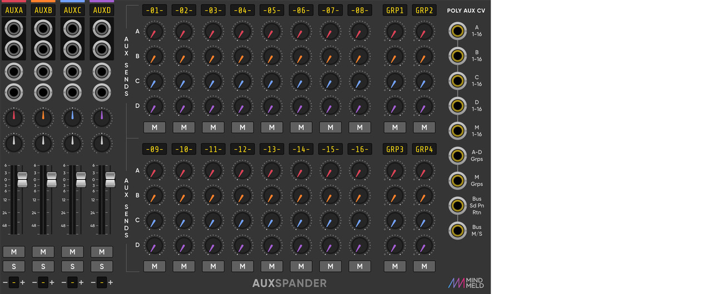

# MindMeld Modular

Modules for [VCV Rack](https://vcvrack.com), available soon in the [plugin manager](https://vcvrack.com/plugins.html). Preview builds are now available in the _Releases_ section in this repository.

Mind Meld is a designer / developer collaboration for VCV Rack between Marc '_Spock_' Boulé (coding and development) and Steve '_Make it so_' Baker (concept and design). 

Version 1.1.1

# Modules 

The following modules are part of the MindMeld module pack.

* [MixMaster](#mixmaster): 16-track stereo mixer with 4 group busses. Manual: (coming soon)

* [AuxSpander](#auxspander): 4-aux FX bus expander for MixMaster. Manual: (see MixMaster manual)

## MixMaster 

The MixMaster beams the following features into your Rack for your demanding mixing needs:

* 16 mono/stereo tracks
* 4 aux busses (requires [AuxSpander](#auxspander)) and 4 group busses
* Editable track labels (scribble strips)
* Gain adjustment (trim) on every track (±20 dB)
* Hi Pass Filter (HPF) on every track (18 dB/oct.)
* Low Pass Filter (LPF) on every track (12 dB/oct.)
* Fade automation with lin/log/exp curves
* Track re-ordering and copy/paste settings
* User selectable pan law
* Stereo balance and true stereo panning
* Accurate RMS and Peak VUs with peak hold
* User selectable VU colour and display colour
* Long fader runs and fader linking
* Inserts on every track and bus
* Direct outs for every track and bus
* Chain input
* Dim and fold to mono on the Master
* CV visualisation
* CV control over just about everything...

Many labels contain separate menus that are different from the module's main menu; these can be accessed by right-clicking the labels.

## AuxSpander 

4-aux FX bus expander for MixMaster, must be placed immediately to the right of the MixMaster module.

